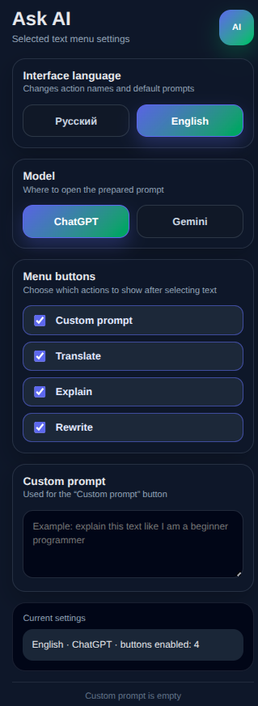
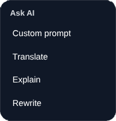

# Ask AI Selection Extention

**Ask AI Selection is a lightweight Chrome extension that lets you select text on any webpage and quickly send it to an AI assistant using a small floating action menu.**

Ask AI Selection — лёгкое расширение для Chrome, которое позволяет выделить текст на любой веб-странице и быстро отправить его в нейросеть через небольшое всплывающее меню.

---

## Features
Возможности

**Ask AI Selection helps you work with selected text faster. Instead of manually copying text, opening an AI service, writing a prompt, and pasting the text, you can select text and choose an action from a small floating menu.**

Ask AI Selection помогает быстрее работать с выделенным текстом. Вместо того чтобы вручную копировать текст, открывать нейросеть, писать промпт и вставлять текст, можно выделить фрагмент и выбрать действие во всплывающем меню.

**Main features:**
Основные возможности:

- **Select text on a webpage and open a floating AI menu.**
- **Choose quick actions: Custom Prompt, Translate, Explain, Rewrite.**
- **Select the target AI service: ChatGPT or Gemini.**
- **Switch interface language between English and Russian.**
- **Enable or disable specific menu actions.**
- **Set your own custom prompt.**
- **Automatically insert prompts into Gemini when possible.**
- **Open ChatGPT with a prepared prompt.**

  - Выделяйте текст на веб-странице и открывайте всплывающее AI-меню.
  - Используйте быстрые действия: Кастомный промпт, Перевести, Объяснить, Перефразировать.
  - Выбирайте целевую нейросеть: ChatGPT или Gemini.
  - Переключайте язык интерфейса между английским и русским.
  - Включайте и отключайте отдельные действия в меню.
  - Настраивайте собственный кастомный промпт.
  - Автоматически вставляйте промпт в Gemini, когда это возможно.
  - Открывайте ChatGPT с подготовленным промптом.

---

## Demo
Демонстрация

### Extension popup
Popup расширения



**The popup lets you choose the interface language, AI model, visible menu actions, and custom prompt.**
Popup позволяет выбрать язык интерфейса, AI-модель, видимые действия меню и кастомный промпт.


### Floating menu
Всплывающее меню



**After selecting text, the extension shows a floating menu with quick AI actions.**
После выделения текста расширение показывает всплывающее меню с быстрыми AI-действиями.


---

## Installation
Установка

**This extension is not published in the Chrome Web Store yet. You can install it manually in Developer Mode.**
Расширение пока не опубликовано в Chrome Web Store. Его можно установить вручную через режим разработчика.

### 1. Download the project
1. Скачайте проект

**Download this repository as a ZIP archive or clone it with Git.**
Скачайте этот репозиторий как ZIP-архив или клонируйте его через Git.

```bash
git clone https://github.com/IRX01/YOUR_REPOSITORY_NAME.git
```

### 2. Open Chrome Extensions page
2. Откройте страницу расширений Chrome

**Open this page in Chrome:**
Откройте эту страницу в Chrome:

```text
chrome://extensions
```

### 3. Enable Developer Mode
3. Включите режим разработчика

**Turn on Developer Mode in the top-right corner of the extensions page.**
Включите режим разработчика в правом верхнем углу страницы расширений.

### 4. Load the extension
4. Загрузите расширение

**Click Load unpacked and select the extension project folder.**
Нажмите Load unpacked / Загрузить распакованное расширение и выберите папку проекта.

**The selected folder must contain `manifest.json` in its root.**
В выбранной папке файл `manifest.json` должен находиться в корне.

**Correct folder example:**
Пример правильной папки:
```text
ask-ai-extension/
  manifest.json
  popup.html
  popup.css
  popup.js
  content.js
  icons/
```

**Incorrect folder example:**
Пример неправильной папки:
```text
ask-ai-extension/
  ask-ai-extension/
    manifest.json
```

---

# ❗❗❗ Important notice ❗❗❗
❗❗❗ Важное предупреждение ❗❗❗

**Before using the extension with ChatGPT or Gemini, make sure you are logged into your personal account in the selected AI service.**
Перед использованием расширения с ChatGPT или Gemini убедитесь, что вы вошли в личный аккаунт в выбранной нейросети.

**If you are not logged in, the extension may open the AI service, but the prompt may not be inserted or processed correctly.**
Если вы не вошли в аккаунт, расширение может открыть сайт нейросети, но промпт может не вставиться или не обработаться корректно.

**This extension does not create accounts, bypass login pages, or provide access to paid AI features.**
Это расширение не создаёт аккаунты, не обходит страницы входа и не предоставляет доступ к платным функциям нейросетей.

---

## How to use
Как пользоваться

### 1. Select text
1. Выделите текст

**Select any text on a normal webpage.**
Выделите любой текст на обычной веб-странице.

**The extension does not show the floating menu inside editable fields such as search inputs, textareas, and text editors.**
Расширение не показывает всплывающее меню внутри редактируемых полей, например поисковых строк, textarea и текстовых редакторов.

### 2. Choose an action
2. Выберите действие

**After selecting text, a small floating menu appears near the selection.**
После выделения текста рядом с выделением появится небольшое всплывающее меню.

**Available actions:**
Доступные действия:

- **Custom Prompt**
- **Translate**
- **Explain**
- **Rewrite**

- Кастомный промпт
- Перевести
- Объяснить
- Перефразировать

### 3. Open the selected AI service
3. Откройте выбранную нейросеть

**Click an action, and the extension will prepare a prompt and open the selected AI service.**
Нажмите на действие, и расширение подготовит промпт и откроет выбранную нейросеть.

**For ChatGPT, the extension opens ChatGPT with the prepared prompt.**
Для ChatGPT расширение открывает ChatGPT с подготовленным промптом.

**For Gemini, the extension opens Gemini with the prepared prompt.**
Для Gemini расширение открывает Gemini с подготовленным промптом.

---

## Settings
Настройки

**Click the extension icon in the Chrome toolbar to open the settings window.**
Нажмите на иконку расширения на панели Chrome, чтобы открыть окно с настройками.

### Interface language
Язык интерфейса

**You can switch the interface language between English and Russian.**
Вы можете переключать язык интерфейса между английским и русским.

**The selected language changes menu labels and default prompt templates.**
Выбранный язык меняет названия кнопок меню и стандартные шаблоны промптов.

### AI model
AI-модель

**You can choose which AI service should be opened after clicking an action.**
Вы можете выбрать, какая нейросеть будет открываться после нажатия на действие.

**Currently supported services:**
Сейчас поддерживаются:

- #### ChatGPT
- #### Google Gemini

### Menu buttons
Кнопки меню

**You can enable or disable specific actions in the floating menu.**
Вы можете включать и отключать отдельные действия во всплывающем меню.

**For example, if you do not use Rewrite, you can turn it off.**
Например, если вы не используете Rewrite / Перефразировать, эту кнопку можно отключить.

### Custom prompt
Кастомный промпт

**You can set your own custom instruction.**
Вы можете задать собственную инструкцию.

**When you click Custom Prompt, the extension combines your custom prompt with the selected text.**
Когда вы нажимаете Custom Prompt / Кастомный промпт, расширение объединяет вашу инструкцию с выделенным текстом.

**Example:**
Пример:

```text
Explain this text like I am a beginner programmer.
```

```text
Объясни этот текст так, как будто я начинающий программист.
```

**After clicking the "Custom Prompt" button, the selected neural network will open with a prompt.**
После нажатия на кнопку "Кастомный промпт" откроется выбранная нейросеть с промптом

```
Explain this text like I am a beginner programmer.

Text: {Your selected text}
```

---

## Privacy
Приватность

**Ask AI Selection does not use its own server.**
Ask AI Selection не использует собственный сервер.

**Your settings are stored locally in your browser using Chrome extension storage.**
Ваши настройки хранятся локально в браузере через хранилище расширений Chrome.

**Selected text is only used after you click one of the actions in the floating menu.**
Выделенный текст используется только после того, как вы нажимаете одно из действий во всплывающем меню.

**The prepared prompt is sent only to the AI service you selected.
Подготовленный промпт отправляется только в выбранную вами нейросеть.

**The extension does not collect analytics, sell user data, or track browsing history.**
Расширение не собирает аналитику, не продаёт пользовательские данные и не отслеживает историю браузера.

---

## Known limitations
Известные ограничения

**The extension may not work on Chrome internal pages such as `chrome://extensions` or `google.com`**
Расширение может не работать на внутренних страницах Chrome, например `chrome://extensions`

**The extension intentionally does not show the floating menu inside the pages of supported AI services.**
Расширение специально не показывает всплывающее меню внутри страниц поддерживаемых нейросетей.

**The extension does not automatically submit prompts. You stay in control and can review the prompt before sending it.**
Расширение не отправляет промпты автоматически. Вы сохраняете контроль и можете проверить промпт перед отправкой.

**Some websites may block or modify text selection behavior, which can affect the floating menu.**
Некоторые сайты могут блокировать или изменять поведение выделения текста, из-за чего всплывающее меню может работать иначе.

---

## Project structure
Структура проекта

**Basic project structure:**
Базовая структура проекта:
```text
ask-ai-extension/
  manifest.json
  popup.html
  popup.css
  popup.js
  content.js
  icons/
    icon16.png
    icon32.png
    icon48.png
    icon128.png
```

---

## Development
Разработка

**This project currently uses plain HTML, CSS, and JavaScript.**
Сейчас проект использует обычные HTML, CSS и JavaScript.

**No build step is required.**
Сборка проекта пока не требуется.

**To test local changes:**
Чтобы проверить локальные изменения:

1. **Open `chrome://extensions`.**
2. **Click Reload on the extension card.**
3. **Refresh the webpage where you are testing the floating menu.**
- 
1. Откройте `chrome://extensions`.
2. Нажмите Reload / Обновить на карточке расширения.
3. Обновите страницу, на которой тестируете всплывающее меню.

---

## Roadmap
Планы развития

**Planned improvements:**
Планируемые улучшения:

- **Add more AI services.**
- **Add toast notifications.**
- **Add more actions such as Summarize and Fact-check.**
- **Add export and import settings.**
- **Add better icons and screenshots.**
- **Add automated tests.**
- **Publish the extension in the Chrome Web Store.**

- Добавить больше нейросетей.
- Добавить уведомления.
- Добавить больше действий, например Summarize и Fact-check.
- Добавить экспорт и импорт настроек.
- Добавить более качественные иконки и скриншоты.
- Добавить автотесты.
- Опубликовать расширение в Chrome Web Store.

---

## Contributing
Участие в разработке

**Ideas, issues, and pull requests are welcome.**
Идеи, issues и pull requests приветствуются.

**If you find a bug, please describe:**
Если вы нашли баг, пожалуйста, опишите:

- **Browser and version.**
- **Website where the bug happened.**
- **Selected AI service.**
- **Steps to reproduce the issue.**
- **Expected result.**
- **Actual result.**

- Браузер и версию.
- Сайт, на котором произошёл баг.
- Выбранную нейросеть.
- Шаги для воспроизведения проблемы.
- Ожидаемый результат.
- Фактический результат.

---

## License
Лицензия

MIT License.
Лицензия MIT.
